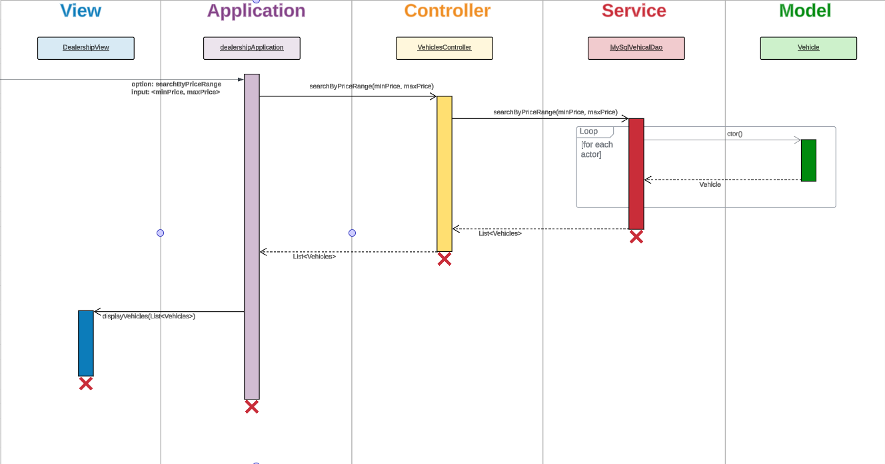
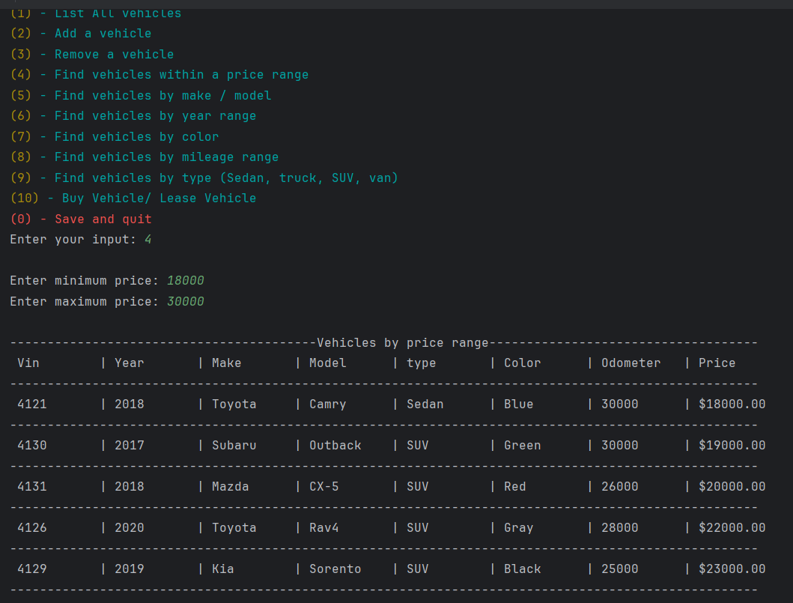
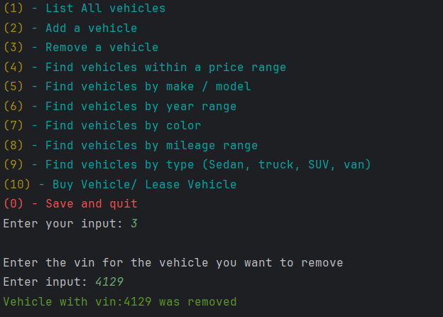
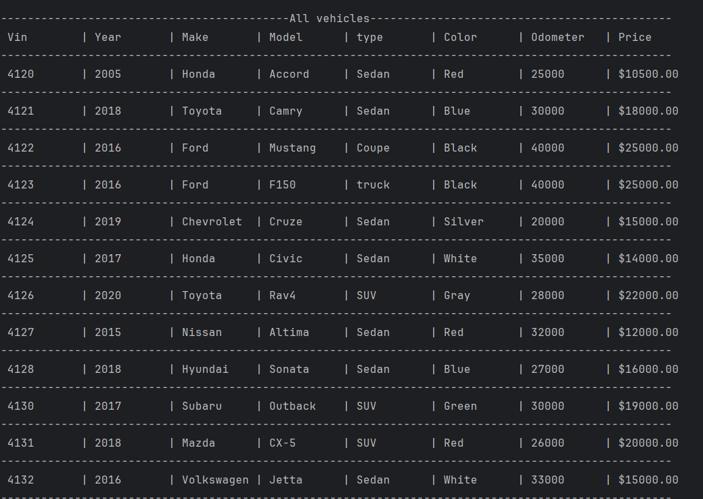
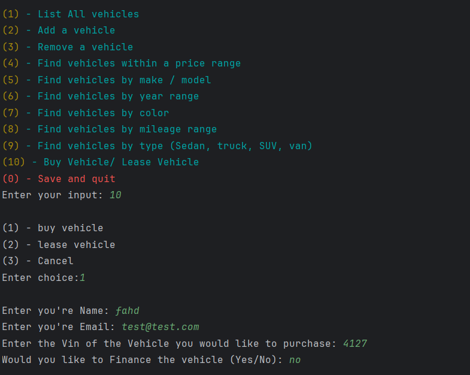
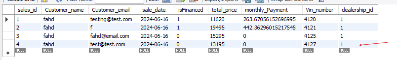

# dealership-application-with-database
### Overview of project
I'm connected my old dealership application that was saving data in a csv file to a database using mySql. In this project I implemented the MVC pattern to split my application into smaller parts. 


## Phase 1
In this phase I added all the search option for the user like search by price range, search by make and model, search by year range, search by color, search by mileage range, search by type using the pattern above.



## Phase 2

In this phase I added the remove and add vehicles feature from the data base. To add a vehicle the user will be prompted for the vehicles information and then it will get saved to the database in the inventory table. When a vehicle gets removed the program will prompted the user for the vin number and then it will remove the vehicle that matches that vin number.



You could see that the vehicle with vin number 4129 is not in the list anymore



## Phase 3

In this phase, i added feature where a user could lease or buy a vehicle. Depending on what the user picks, the program will prompted the user for they're information and create a contract. The contract will then get saved to the database to the sales_contract table or lease_contract table.




## Peace of code that I'm proud of:

I was really proud of this code because I learned a lot about updating item in your database and also executing more then one sql statement at a time.


```java
@Override
    public void addLeaseContract(Contract contract) {
        try (Connection connection = dataSource.getConnection()) {
            Vehicle vehicle = contract.getVehicleSold();

            // Update the vehicle to mark it as sold
            String updateVehicleToSoldSql = """ 
                                                UPDATE vehicles
                                                SET Sold = true
                                                WHERE Vin_number = ?;
                                                """;
            try (PreparedStatement updateVehicle = connection.prepareStatement(updateVehicleToSoldSql)) {
                updateVehicle.setInt(1, vehicle.getVin());
                int rowsAffected = updateVehicle.executeUpdate();

                if (rowsAffected > 0) {
                    // Vehicle update successful, proceed to insert lease contract
                    String sqlAddLease = """
                            INSERT INTO lease_contract
                            "(Customer_name, Customer_email, lease_date, total_price, monthly_Payment, Vin_number, dealership_id) " +
                            "VALUES (?, ?, ?, ?, ?, ?, ?)""";

                    try (PreparedStatement preparedStatement = connection.prepareStatement(sqlAddLease)) {
                        preparedStatement.setString(1, contract.getCustomerName());
                        preparedStatement.setString(2, contract.getCustomerEmail());
                        preparedStatement.setString(3, contract.getDate());
                        preparedStatement.setDouble(4, contract.getTotalPrice());
                        preparedStatement.setDouble(5, contract.getMonthlyPayment());
                        preparedStatement.setInt(6, vehicle.getVin());
                        preparedStatement.setInt(7, 1); // Assuming dealership_id is 1

                        preparedStatement.executeUpdate();
                    } catch (SQLException e) {
                        System.out.println(e);
                    }

                } else {
                    // No rows were updated in vehicles table, likely due to incorrect VIN or vehicle already sold
                    System.out.println("Wrong VIN number or the vehicle is already sold");
                }
            } catch (SQLException e) {
                System.out.println(e);
            }
        } catch (SQLException e) {
            System.out.println(e);
        }
    }
```